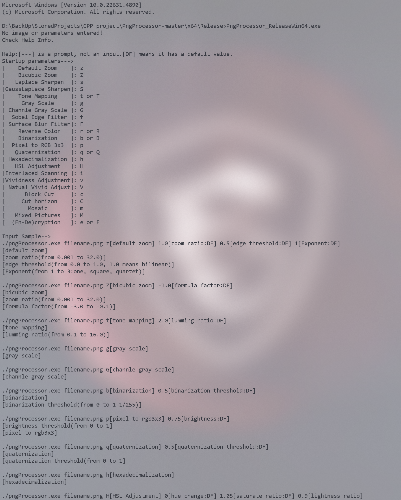

# Project Name
- This is a gadget for working with PNG images, which is opened using the console
- 这是一个用于处理PNG图像的小工具,它使用控制台打开

## Introduction

- This is a personal project of me @IMSDcrueoft that uses lodepng as the decoder and encoder, so you can also find a way to change the decoder encoder yourself
- 这是个我 @IMSDcrueoft 的一个个人项目,使用了lodepng作为解码器和编码器,所以你也可以自己想办法把解码器编码器换了

## Features

- Some of the more basic image post-processing algorithms
- 

## Usage
oops, nothing here

## Contributing

While this is primarily a personal project, contributions are welcome. If you find any issues or have suggestions for improvements, please open an issue or submit a pull request. But I don't look at github very often, so I might put your issue on hold for a long time lol.
虽然这主要是个人项目,但欢迎贡献.如果您发现任何问题或有改进建议,请打开一个问题或提交拉取请求.但是我不经常看 github,所以我可能会把你的问题搁置很长一段时间.

## License

This project is licensed under the MIT License - see the LICENSE file for details.